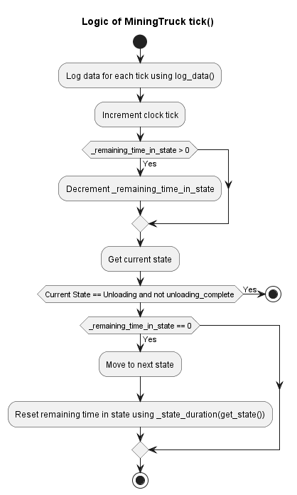

# Design and Implementation

## Table of Contents
- [Initial Thoughts](#initial-thoughts)
- [Final Thoughts](#final-thoughts)
- [Key Components](#key-components)
- [Operation Details](#features)
- [Simulation Requirements](#simulation-requirements)
- [Additional Assumptions](#additional-assumptions)
    - [Operational Assumptions](#operational-assumptions)
    - [Modeling Assumptions](#modeling-assumptions)
- [Implementation](#implementation)
    - [Core Architecutre](#core-architecture)
    - [Class Diagram](#class-diagram)
    - [MiningTruck State Machine](#miningtruck-state-machine)
    - [UnloadingStation State Machine](#unloading-station-state-machine)
    - [MiningSimulator State Machine](#miningsimulator---coordinator-state-machine)
        - [Assignment Algorithm](#assignment-algorithm)
        - [Analyzing Results Data](#analyzing-data-for-truck-and-stations)

# Initial Thoughts
While established discrete-event simulation libraries like SimPy exist and could be suitable, this project involves building the simulation framework from scratch. This approach was chosen specifically to:

- Demonstrate software design and implementation skills.
- Ensure all code developed for this project is original.

Therefore, no external simulation libraries were utilized.

# Final Thoughts
Due to lack of time, I left out some of the following:
- Unit tests for analysis functions
- Detailed results plotting/visualization for truck/station metrics. 
- Testing around more edge cases for the simulation.
- Optimizing the analysis scripts for speed. 

# Key Components
- **Mining Trucks**: These vehicles perform the actual mining tasks.
- **Mining Sites**: Locations on the moon where the trucks extract Helium. Assume an infinite
number of sites, ensuring trucks always have access to mine without waiting.
- **Mining Unload Stations**: 
    - Designated stations where trucks unload the mined Helium. Each
    station can handle one truck at a time.

## Operation Details
There are (n) mining trucks and (m) mining unload stations.
- Mining trucks can spend a random duration between 1 to 5 hours mining at the sites.
- It takes a mining truck 30 minutes to travel between a mining site and an unload station.
- Assume all trucks are empty at a mining site when the simulation starts.
- Unloading the mined material at a station takes 5 minutes.
- Trucks are assigned to the first available unload station. If all stations are occupied, trucks
queue at the station with the shortest wait time and remain in their chosen queue.

## Simulation Requirements
- The simulation must be configurable to accommodate various numbers of mining trucks (n)
and unload stations (m).
- Calculate and report statistics for the performance and efficiency of each mining truck and
unload station.
- The simulation represents 72 hours of non-stop mining and must execute faster than
real-time to provide timely analysis.

Based on the above details, this project aims to develop a mining simulator to play the simulation over 72 hours. All the code here is developed in python. 

## Additional Assumptions
To make the design simpler, some additional assumptions have been made prior to starting this project
### Operational Assumptions
- Mining trucks have 100% efficiency when traveling - there is no loss of mined Helium when traveling between the unload stations and the mining sites. 
- When at the mining site, the truck is filled from 0% to 100%. Similarly, at the unload station, the truck is emptied from 100% to 0%. 
- Based on the constraints provided, each truck spends a random time between 1 hour and 5 hours at the mining sites. 
    - For this simulation, since no granularity has been mentioned, assume each truck can spend any time between 1-hour and 5-hours, in 30-min steps randomly. For example, Truck 1 may spend 1.5 hours whereas Truck 2 may spend 4.5 hours. 
    - For the initial simulation runs, assume that each truck's mining efficiency changes at runtime - This implies that the random mining duration is computed each time the mining truck reaches the mining site. 

### Modeling Assumptions

Some of the modeling assumptions:
- One of the requirements is that model runs faster than real-time. Since, no real-time factor is provided, run the model as fast as possible. 
    - That being said, design the simulation in a way that we could possibly introduce a real-time factor later if needed. 
- For selecting a discrete time-step for this simulation:
    - The smallest unit of time described in the constraints is 5 minutes (unloading time). Since all other time constraints are in multiples of 5 minutes, it makes sense to choose 5-minutes as the discrete step-size. This helps us in running the simulation as fast as possible. 
    - All time related values in this project will be represented in terms of ticks:
        - 1 tick = 5 minutes (Unloading time)
        - 6 ticks = 30 minutes (Traveling time)
        - 12 ticks = 1 hour (Minimum time to complete mining)
        - 60 ticks = 5 hours (Maximum time to complete mining)
        - 864 ticks = 72 hours (Simulation stop time of 72 hours)

# Implementation

This project utilizes standard Object-Oriented Programming (OOP) principles in Python to create a flexible simulation framework. The design accommodates the following fundamental simulation characteristics:
- **System Composition**: A simulation is composed of multiple interacting entities, referred to as nodes.
- **Node Heterogeneity & Interaction**: Nodes can represent diverse entity types within the simulation and must be able to interact with other nodes (potentially of different types).
- **Time-Based Behavior**: The simulation progresses in discrete time-steps. During each step, nodes typically execute an action or update/maintain their internal state.
- **Coordination**: A central simulator component is responsible for orchestrating the execution of node actions and managing state transitions consistently across each time-step.

## Core Architecture
Based on the above, the system will be designed used the following:
- SimulationNode (Abstract class)
    - **MiningTruck**: Represents a mining truck in the simulation
    - **UnloadingStation**: Represents an unloading station in the simulation
- **MiningSimulator** (Coordinator)
    - Orchestrates the overall discrete-event simulation.
    - This class manages collections of **SimulationNode** objects(*n mining trucks* and *m unloading stations* instances)
    - Contains the main simulation loop logic:
        * Advances simulation time step-by-step.
        * Invokes the appropriate methods (e.g., `tick()`) on each node for each time step.
        * Runs the simulation until a specified stop condition is met.

## Class Diagram 

More documentation about each of the classes/class members/methods can be found in the python code.

## MiningTruck State Machine

Mining truck can be located at : `.\mining_sim\nodes\truck.py`

MiningTruck state is defined as an enum that has four values:
- OnRoad_ToMine
- AtMine
- OnRoad_ToUnload
- Unloading

For each of these states, the time spent in that state is obtained using `_state_duration()` function.

Logic for the MiningTruck state machine - `tick()` function:
- Simulation coordinator can pass in `unloading_completez` flag to MiningTruck's `tick()` function to signal that the unload is complete. At this point, the truck transitions from `Unloading` to `OnRoad_ToMine` again. 
- By default, if the truck is queued for unload, only the tick counter is incremented while it stays in the unload queue until unloading is completed. 

## Unloading Station State Machine
UnloadingStation can be located at: `.\mining_sim\nodes\unloadstation.py`

Some implementation callouts:
- Unloading station contains a `UnloadQueue` object to hold the trucks queued for unload during a tick if the unloading station is already occupied. 
- In order to make the code scalable, `threading.lock()` is used in `UnloadQueue`'s functions to prevent race conditions, if multithreading is used in the future.  
-`get_wait_time()` function returns the current wait time of the queue.

## MiningSimulator - Coordinator State Machine
MiningSimulator ochestrates the overall discrete-event simulation and manages a collection of **SimulationNode** objects(`n` mining trucks and `m` unloading station instances)

### Assignment Algorithm
When queuing trucks at an unloading station, the following algorithm is used for the requirements specified earlier: 
1. Sort station information based on wait time and find stations with minimum wait time
2. Assign trucks to unloading stations with minimum queue time until all new trucks are exhausted.
3. If there are still trucks remaining after assigning to stations with minimum queue time, update stations information and repeat from step 1.

### Logic Diagram
Logic diagram for the MiningSimulator's `tick()` function is given below:

### Running the simulation - run() function
`MiningSimulator` class has a `run()` function that can be used to run the simulation for a specified amount of time (default stop time of 24 hours, max 100 hours). This function runs the simulation, collects required data and analyzes some of the key metrics for this project. 

### Analyzing data for truck and stations
`MiningSimulator` class has a `analyze_simulation_logs()` to process the data logs from trucks and stations. This function compute some of the key metrics for each individual node (truck or station) and also the average across all trucks/stations. 

For the mining truck, essentially we want to calculate the time spent in each of the three main states: AtMine, OnRoad and Unloading (includin waiting in queue). To calculate the efficiency, any time spent in the queue can be considered as not optimal because the mining truck is not performing any useful action. As a result efficiency of truck is calculated as: `100*total_time_waiting/total_time`

The key metrics being tracked for trucks are:
1. **Mining Time %**: The total mining time as a % of total simulation time. 
2. **OnRoad Time %**: The total on-road time as a % of total simulation time. This includes both traveling to and from the mining site.
3. **Unloading Time %**: The total unloading time as a % of total simulation time. This only includes the actual unloading time and does not include the time spent waiting in queue.
4. **Queued Time %**: The total queued waiting time as a % of total simulation time. 
5. **Efficiency %**: The efficiency of the mining truck. Efficiency of truck is calculated as: `100*total_time_waiting_queue/total_time`.

The key metrics being tracked for stations are:

1. **Average Wait Time (in ticks)**: Average wait time for a given station across the entire simulation. *NOTE: Ideally this value should be <=1 (if enough stations are present) since each truck takes 1 tick for completing unload action*
2. **Max Wait Time (in ticks)**: The maximum wait time at any point during the simulation (max trucks queued at a tick).
3. **Efficiency %**: Calculated as `(1 - (time_queued / total_time)) * 100`, where time_queued is the count of instances where instantaneous wait_time is greater than 2. 

