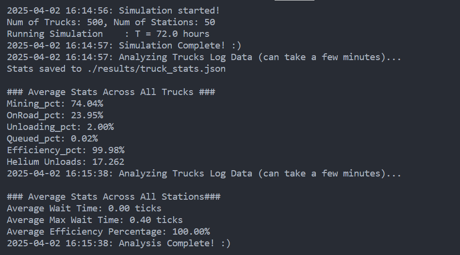

# Sample Results

Some sample results from running the simulation are attached below. One question that I asked myself when starting this work was: `How many stations does a given number of trucks need for maximising Helium output?`. I used hand calculation for a rough estimate:
- Each unload operation takes 5 minutes or one simulation tick. 
- Each one-way trip for the Truck on the road in 30 minutes or 6 ticks, so 12 ticks for roundtrip. 
- At the mine, the minimum amount of time the truck can spend is 1 hour or 12 ticks.
- Adding these together we have 25 ticks per trip to perform one Helium mining + traveling + unload operation.

Based on this it is safe to say, having 25 trucks per station would give a close to ideal operation maximising efficiency. Adding more stations after that should not result in noticeable difference in efficiencies. 

Let's see if this is true using the sample runs below: 

## Sample Run #1 (n_trucks = 500, m_trucks = 10)

We are under our *optimal* truck/station ratio of 25 in this case. You can see that the average truck efficiency is 97% and average station efficiency is 84%. 

## Sample Run #2 (n_trucks = 500, m_trucks = 20)

We are at our *optimal* truck/station ratio of 25 in this case. Both the truck and station efficiencies are above 99%!

## Sample Run #3 (n_trucks = 500, m_trucks = 50)

We are above our *optimal* truck/station ratio of 25 in this case. Adding more stations does not result in a noticeable increase in efficiency.
